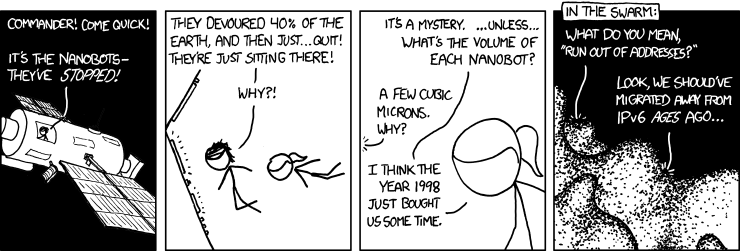

DDNS service for the nanobot swarm.

If you're here, you probably either already have or are looking for a DDNS service. This one specifically:

- Has no accounts, usernames, or identifying information whatsoever.
- Is therefore totally anonymous. (Except for the IP address obviously)
- Has no custom/bespoke "client" software
- Is easily self-hostable on a $5/month VPS + any TLD you own.
- Provides consistent, cryptographically-secure UUID domain names based on a secret provided by the client.

For a single computer, say a homelab server, the entire process is as simple as putting a `curl` command in your crontab and optionally a CNAME that points to the UUID DDNS address.

You can try it out right now! I host an instance under `{{page.nanobots_domain}}` that I am leaving open to the general public. The docs on this site show their examples using this public instance.
